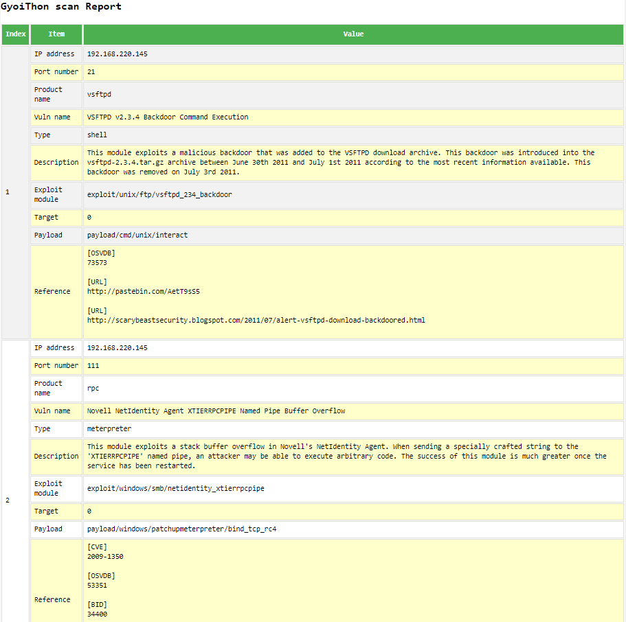

# **GyoiThon**   
**Next generation penetration test tool**

---

### Presentation
 * [JANOG41](https://www.janog.gr.jp/meeting/janog41/program/sp5sts)  
 * [Black Hat ASIA 2018 Arsenal](https://www.blackhat.com/asia-18/arsenal/schedule/index.html#gyoithon-9651)  
 * [DEFCON26 DemoLabs](https://www.defcon.org/html/defcon-26/dc-26-demolabs.html#GyoiThon)  

## Overview
 GyoiThon is a **growing penetration test tool using Machine Learning**.  

 GyoiThon **identifies the software installed on web server** (OS, Middleware, Framework, CMS, etc...) based on the learning data. After that, it **executes valid exploits** for the identified software using Metasploit. Finally, it **generates reports** of scan results. GyoiThon executes the above processing **automatically**. 

 * Processing steps  
 

 GyoiThon executes the above "Step1" - "Step4" fully automatically.  
 **User's only operation is to input the top URL** of the target web server in GyoiThon.

 It is very easy!  
 You can identify vulnerabilities of the web servers without taking time and effort.

## Processing flow
#### Step 1. Gather HTTP responses.
 GyoiThon gathers several HTTP responses of target website while **crawling**.  
 The following are example of HTTP responses gathered by GyoiThon.  

 * Example.1  
 ```
 HTTP/1.1 200 OK
 Date: Tue, 06 Mar 2018 03:01:57 GMT
 Connection: close
 Content-Type: text/html; charset=UTF-8
 Etag: "409ed-183-53c5f732641c0"
 Content-Length: 15271

 ...snip...
 ```

 * Example.2  
 ```
 HTTP/1.1 200 OK
 Date: Tue, 06 Mar 2018 06:56:17 GMT
 Connection: close
 Content-Type: text/html; charset=UTF-8
 Set-Cookie: f00e68432b68050dee9abe33c389831e=0eba9cd0f75ca0912b4849777677f587;
 path=/;
 Content-Length: 37496

 ...snip...
 ```

 * Example.3  
 ```
 HTTP/1.1 200 OK
 Date: Tue, 06 Mar 2018 04:19:19 GMT
 Connection: close
 Content-Type: text/html; charset=UTF-8
 Content-Length: 11819

 ...snip...

  <script src="/core/misc/drupal.js?v=8.3.1"></script>
 ```

#### Step 2. Identify product name.
 GyoiThon identifies product name installed on web server using following **two methods**.

##### 1. Based on Machine Learning.  
  By using Machine Learning (**Naive Bayes**), GyoiThon identifies software based on a **combination of slightly different features** (Etag value, Cookie value, specific HTML tag etc.) for each software. Naive Bayes is learned using the training data which example below (Training data). Unlike the signature base, Naive Bayes is stochastically identified based on various features included in HTTP response when it cannot be identified software in one feature.

   * Example.1  
   ```
   Etag: "409ed-183-53c5f732641c0"
   ```
   GyoiThon can identify the web server software **Apache**.  
   This is because GyoiThon learns features of Apache such as "**Etag header value** (409ed-183-53c5f732641c0). In our survey, Apache use **combination of numeral and lower case letters as the Etag value**. And, Etag value is **separated 4-5 digits and 3-4 digits and 12 digits, final digit is 0** in many cases.  

   * Example.2  
   ```
   Set-Cookie: f00e68432b68050dee9abe33c389831e=0eba9cd0f75ca0912b4849777677f587;
   ```
   GyoiThon can identify the CMS **Joomla!**.  
   This is because GyoiThon learns features of Joomla! such as "**Cookie name** (f00e6 ... 9831e) " and "**Cookie value** (0eba9 ... 7f587). In our survey, Joomla! uses **32 lower case letters as the Cookie name and Cookie value** in many cases.

###### Training data (One example)  
 * Joomla! (CMS)
 ```
 Set-Cookie: ([a-z0-9]{32})=[a-z0-9]{26,32};
 Set-Cookie: [a-z0-9]{32}=([a-z0-9]{26,32});
 ...snip...
 ```
 * HeartCore (Japanese famous CMS)  
 ```
 Set-Cookie:.*=([A-Z0-9]{32});.*
 <meta name=["'](author)["'] content=["']{2}.*
 ...snip...
 ```

 * Apache (Web server software)  
 ```
 Etag:.*".*-[0-9a-z]{3,4}-[0-9a-z]{13}")[\r\n]
 ...snip...
 ```

##### 2. Based on String matching.  
 Of course, GyoiThon can identify software by **string matching** also used in traditional penetration test tools. Examples are shown below.

   * Example.3  
   ```
   <script src="/core/misc/drupal.js?v=8.3.1"></script>
   ```
   GyoiThon can identify the CMS **Drupal**.  
   It is very easy.  

#### Step 3. Exploit using Metasploit.
GyoiThon executes exploit corresponding to the identified software using Metasploit and it checks whether the software is affected by the vulnerability.  

   

 * Running example  
 ```
 [*] exploit/multi/http/struts_code_exec_exception_delegator, target: 1, payload: linux/x86/shell/reverse_nonx_tcp, result: failure
 [*] exploit/multi/http/struts_code_exec_exception_delegator, target: 1, payload: linux/x86/shell/reverse_tcp, result: failure
 [*] exploit/multi/http/struts_code_exec_exception_delegator, target: 1, payload: linux/x86/shell/reverse_tcp_uuid, result: failure
 [*] exploit/multi/http/struts_code_exec_exception_delegator, target: 1, payload: linux/x86/shell_bind_ipv6_tcp, result: failure
 [*] exploit/multi/http/struts_code_exec_exception_delegator, target: 1, payload: linux/x86/shell_bind_tcp, result: failure

 ...snip...

 [*] exploit/linux/http/apache_continuum_cmd_exec, target: 0, payload: generic/custom, result: failure
 [*] exploit/linux/http/apache_continuum_cmd_exec, target: 0, payload: generic/debug_trap, result: failure
 [*] exploit/linux/http/apache_continuum_cmd_exec, target: 0, payload: generic/shell_bind_tcp, result: failure
 [*] exploit/linux/http/apache_continuum_cmd_exec, target: 0, payload: generic/shell_reverse_tcp, result: failure
 [*] exploit/linux/http/apache_continuum_cmd_exec, target: 0, payload: generic/tight_loop, result: bingo!!
 ```

#### Step 4. Generate scan report.
GyoiThon generates a report that summarizes vulnerabilities.  
Report's style is html.  

 * sample
 [](https://github.com/gyoisamurai/GyoiThon/blob/master/classifier4gyoithon/report/gyoithon_report.html)

## Demonstration movie.

 [](http://www.youtube.com/watch?v=jmi43eZOE9w)  

 https://www.youtube.com/watch?v=jmi43eZOE9w

## Installation
#### Step.0 git clone GyoiThon's repository.
```
root@kali:~# git clone https://github.com/gyoisamurai/GyoiThon.git
```

#### Step.1 Get python3-pip
```
root@kali:~# apt-get install python3-pip
```

#### Step.2 install required packages.
```
root@kali:~# cd GyoiThon
root@kali:~/GyoiThon# pip3 install -r requirements.txt
```

#### Step.3 Edit config.ini of GyoiThon.
You have to be match server_host value with IP address of your Kali Linux.  

```
root@kali:~/GyoiThon# cd classifier4gyoithon
root@kali:~/GyoiThon/classifier4gyoithon# vim config.ini
...snip...

[GyoiExploit]
server_host      : 192.168.220.144
server_port      : 55553
msgrpc_user      : test
msgrpc_pass      : test1234
timeout          : 10
LHOST            : 192.168.220.144
LPORT            : 4444

...snip...
```

 |config|description|
 |:---|:---|
 |server_host|IP address of your server that launched Metasploit. Your setting value `ServerHost` in Step2.|
 |server_port|Any port number of your server that launched Metasploit. Your setting value `ServerPort` in Step2.|
 |msgrpc_user|Metasploit's user name using authentication. Your setting value `User` in Step2.|
 |msgrpc_pass|Metasploit's password using authentication. Your setting value `Pass` in Step2.|
 |LHOST|IP address of your server that launched Metasploit. Your setting value `ServerHost` in Step2.|

#### Step.4 Initialize Metasploit DB
Firstly, you initialize metasploit db (postgreSQL) using msfdb command.  

```
root@kali:~# msfdb init
```

#### Step.5 Launch Metasploit Framework
You launch Metasploit.  

```
root@kali:~# msfconsole
______________________________________________________________________________
|                                                                              |
|                   METASPLOIT CYBER MISSILE COMMAND V4                        |
|______________________________________________________________________________|
     \\                                  /                      /
      \\     .                          /                      /            x
       \\                              /                      /
        \\                            /          +           /
         \\            +             /                      /
          *                        /                      /
                                  /      .               /
   X                             /                      /            X
                                /                     ###
                               /                     # % #
                              /                       ###
                     .       /
    .                       /      .            *           .
                           /
                          *
                 +                       *

                                      ^
####      __     __     __          #######         __     __     __        ####
####    /    \\ /    \\ /    \\      ###########     /    \\ /    \\ /    \\      ####
################################################################################
################################################################################
# WAVE 4 ######## SCORE 31337 ################################## HIGH FFFFFFFF #
################################################################################
                                                          https://metasploit.com


      =[ metasploit v4.16.15-dev                         ]
+ -- --=[ 1699 exploits - 968 auxiliary - 299 post        ]
+ -- --=[ 503 payloads - 40 encoders - 10 nops            ]
+ -- --=[ Free Metasploit Pro trial: http://r-7.co/trymsp ]

msf >
```

#### Step.6 Launch RPC Server
You launch RPC Server of Metasploit following.  

```
msf> load msgrpc ServerHost=192.168.220.144 ServerPort=55553 User=test Pass=test1234
[*] MSGRPC Service: 192.168.220.144:55553
[*] MSGRPC Username: test
[*] MSGRPC Password: test1234
[*] Successfully loaded plugin: msgrpc
```

|msgrpc options|description|
|:---|:---|
|ServerHost|IP address of your server that launched Metasploit. Above example is `192.168.220.144`.|
|ServerPort|Any port number of your server that launched Metasploit. Above example is `55553`.|
|User|Any user name using authentication (default => msf). Above example is `test`.|
|Pass|Any password using authentication (default => random string). Above example is `test1234`.|

## Usage
#### Step.0 Edit target file.
GyoiThon accesses target server using host.txt.  
So, you have to edit [`host.txt`](https://github.com/gyoisamurai/GyoiThon/blob/master/host.txt) before executing GyoiThon.  

 * Example of `host.txt`  
 target server => 192.168.220.148  
 target port => 80  
 target path => /oscommerce/catalog/

 ```
 root@kali:~# cd GyoiThon
 root@kali:~/GyoiThon# vim host.txt
 192.168.220.148 80 /oscommerce/catalog/
 ```

You have to separate IP address, port number and target path using single space.  

#### Step.1 Run GyoiThon
You execute GyoiThon following command.  

```
root@kali:~/GyoiThon# python3 gyoithon.py
```

#### Step.2 Check scan report
Please check scan report using any web browser.  

```
root@kali:~/GyoiThon# cd classifier4gyoithon/report/
root@kali:~/GyoiThon/classifier4gyoithon/report# firefox gyoithon_report.html
```

## Tips
#### 1. How to add string matching patterns.  
`signatures` path includes four files corresponding to each product categories.  

```
local@client:~$ ls "gyoithon root path"/signatures/
signature_cms.txt
signature_framework.txt
signature_os.txt
signature_web.txt
```

 * `signature_cms.txt`  
 It includes string matching patterns of CMS.  
 * `signature_framework.txt`  
 It includes string matching patterns of FrameWork.  
 * `signature_os.txt`  
 It includes string matching patterns of Operating System.  
 * `signature_web.txt`  
 It includes string matching patterns of Web server software.  

If you want to add new string matching patterns, you add new string matching patterns at last line in each file.  

ex) How to add new string matching pattern of CMS at `signature_cms.txt`.  
```
tikiwiki@(Powered by TikiWiki)
wordpress@<.*=(.*/wp-).*/.*>
wordpress@(<meta name="generator" content="WordPress).*>

...snip...

typo@.*(href="fileadmin/templates/).*>
typo@(<meta name="generator" content="TYPO3 CMS).*>
"new product name"@"regex pattern"
[EOF]
```

 |Note|
 |:---|
 |Above new product name must be a name that Metasploit can identify. And you have to separate new product name and regex pattern using `@`.|


#### 2. How to add learning data.  
`signatures` path includes four files corresponding to each product categories.  

```
local@client:~$ ls "gyoithon root path"/classifier4gyoithon/train_data/
train_cms_in.txt
train_framework_in.txt
train_os_in.txt
train_web_in.txt
```

 * `train_cms_in.txt`  
 It includes learning data of CMS.  
 * `train_framework_in.txt`  
 It includes learning data of FrameWork.  
 * `train_os_in.txt`  
 It includes learning data of Operating System.  
 * `train_web_in.txt`  
 It includes learning data of Web server software.  

If you want to add new learning data, you add learning data at last line in each file.  

ex) How to add new learning data of CMS at `train_cms_in.txt`.  
```
joomla@(Set-Cookie: [a-z0-9]{32}=.*);
joomla@(Set-Cookie: .*=[a-z0-9]{26,32});

...snip...

xoops@(xoops\.js)
xoops@(xoops\.css)
"new product name"@"regex pattern"
[EOF]
```

 |Note|
 |:---|
 |Above new product name must be a name that Metasploit can identify. And you have to separate new product name and regex pattern using `@`.|

In addition, since GyoiThon retrains with new training data, you have to delete old training data (`*.pkl`).  

```
local@client:~$ ls "gyoithon root path"/classifier4gyoithon/trained_data/
train_cms_out.pkl
train_framework_out.pkl
train_web_out.pkl
local@client:~$ rm "gyoithon root path"/classifier4gyoithon/trained_data/*.pkl
```

#### 3. How to change "Exploit module's option".
When GyoiThon exploits, it uses **default value** of Exploit module options.  
If you want to change option values, please input any value to `"user_specify"` in [`exploit_tree.json`](https://raw.githubusercontent.com/gyoisamurai/GyoiThon/master/classifier4gyoithon/data/exploit_tree.json) as following.

```

"unix/webapp/joomla_media_upload_exec": {
    "targets": {
        "0": [
            "generic/custom",
            "generic/shell_bind_tcp",
            "generic/shell_reverse_tcp",

...snip...

        "TARGETURI": {
            "type": "string",
            "required": true,
            "advanced": false,
            "evasion": false,
            "desc": "The base path to Joomla",
            "default": "/joomla",
            "user_specify": "/my_original_dir/"
        },
```
Above example is to change value of `TARGETURI` option in exploit module "`exploit/unix/webapp/joomla_media_upload_exec`" to "`/my_original_dir/`" from "`/joomla`".  

#### 4. How to use each instance.
##### `GyoiClassifier.py`  
You can use the log "webconf.csv" gathered by GyoiThon or the log gathered by GyoiClassifier to identify products operated on the target server. Then, the product is identified using machine learning.  

 * Usage (using `webconf.csv`)  
 GyoiClassifier identifies product name using `webconf.csv`.  

 ```
 local@client:~$ python GyoiClassifier.py -h
 GyoiClassifier.py
 Usage:
     GyoiClassifier.py (-t <ip_addr> | --target <ip_addr>) (-p <port> | --port <port>) (-v <vhost> | --vhost <vhost>) [(-u <url> | --url <url>)]
     GyoiClassifier.py -h | --help
 Options:
     -t --target   Require  : IP address of target server.
     -p --port     Require  : Port number of target server.
     -v --vhost    Require  : Virtual Host of target server.
     -u --url      Optional : Full URL for direct access.
     -h --help     Optional : Show this screen and exit.

 local@client:~$ python GyoiClassifier.py -t 192.168.220.148 -p 80 -v 192.168.220.148
 
 ^^^^^^^^^^^^^^^^^^^^^^^^^^^^^^^^^^^^^^^^^^^^^^^^^^^^^^^^^^^^^^^^^^^^^
 　　███╗   ███╗ █████╗  ██████╗██╗  ██╗██╗███╗   ██╗███████╗
 　　████╗ ████║██╔══██╗██╔════╝██║  ██║██║████╗  ██║██╔════╝
 　　██╔████╔██║███████║██║     ███████║██║██╔██╗ ██║█████╗
 　　██║╚██╔╝██║██╔══██║██║     ██╔══██║██║██║╚██╗██║██╔══╝
 　　██║ ╚═╝ ██║██║  ██║╚██████╗██║  ██║██║██║ ╚████║███████╗
 　　╚═╝     ╚═╝╚═╝  ╚═╝ ╚═════╝╚═╝  ╚═╝╚═╝╚═╝  ╚═══╝╚══════╝
 
 　██╗     ███████╗ █████╗ ██████╗ ███╗   ██╗██╗███╗   ██╗ ██████╗
 　██║     ██╔════╝██╔══██╗██╔══██╗████╗  ██║██║████╗  ██║██╔════╝
 　██║     █████╗  ███████║██████╔╝██╔██╗ ██║██║██╔██╗ ██║██║  ███╗
 　██║     ██╔══╝  ██╔══██║██╔══██╗██║╚██╗██║██║██║╚██╗██║██║   ██║
 　███████╗███████╗██║  ██║██║  ██║██║ ╚████║██║██║ ╚████║╚██████╔╝
 　╚══════╝╚══════╝╚═╝  ╚═╝╚═╝  ╚═╝╚═╝  ╚═══╝╚═╝╚═╝  ╚═══╝ ╚═════╝
　 　   __      _   _      _   _                 _        _
　 　  / /  ___| |_( )__  | |_| |__   ___  _ __ | |_ __ _| | __
　 　 / /  / _ \ __|/ __| | __| '_ \ / _ \| '_ \| __/ _` | |/ /
　 　/ /__|  __/ |_ \__ \ | |_| | | | (_) | | | | || (_| |   <
　 　\____/\___|\__||___/  \__|_| |_|\___/|_| |_|\__\__,_|_|\_
 ^^^^^^^^^^^^^^^^^^^^^^^^^^^^^^^^^^^^^^^^^^^^^^^^^^^^^^^^^^^^^^^^^^^^^
 by GyoiClassifier.py
 
 ------------------------------------------
 target     : 192.168.220.148(192.168.220.148):80
 target log : "gyoithon root path"../gyoithon\get_192.168.220.148_80_ip.log
 
 [+] judge :
 [-] category : web server
     product  : unknown
     too low maximum probability.
 [-] category : framework
     product  : unknown
     too low maximum probability.
 [-] category : cms
     -----
     ranking 1
     product     : heartcore
     probability : 6.8966 %
     reason      : [['Set-Cookie: PHPSESSID=44ec9b66c633a7abc374e5f9a4ad4be3', 'Set-Cookie:  PHPSESSID=b1f9a2c2be74f3b3507d5cbb8ea78c75']]
     -----
     ranking 2
     product     : oscommerce
     probability : 6.8966 %
     reason      : [['Set-Cookie: PHPSESSID=44ec9b66c633a7abc374e5f9a4ad4be3', 'Set-Cookie: PHPSESSID=b1f9a2c2be74f3b3507d5cbb8ea78c75']]
     -----
     ranking 3
     product     : joomla
     probability : 6.6667 %
     reason      : [['Set-Cookie: PHPSESSID=44ec9b66c633a7abc374e5f9a4ad4be3', 'Set-Cookie: PHPSESSID=b1f9a2c2be74f3b3507d5cbb8ea78c75']]
 ------------------------------------------
 
 [+] done GyoiClassifier.py
 GyoiClassifier.py finish!!
 ```

 * Usage (using self-gathered log)  
 GyoiClassifier identifies product name using self-gathered log.  
 
 ```
 local@client:~$ python GyoiClassifier.py -t 192.168.220.129 -p 80 -v www.example.com -u http://www.example.com/
 
 ^^^^^^^^^^^^^^^^^^^^^^^^^^^^^^^^^^^^^^^^^^^^^^^^^^^^^^^^^^^^^^^^^^^^^
 　　███╗   ███╗ █████╗  ██████╗██╗  ██╗██╗███╗   ██╗███████╗
 　　████╗ ████║██╔══██╗██╔════╝██║  ██║██║████╗  ██║██╔════╝
 　　██╔████╔██║███████║██║     ███████║██║██╔██╗ ██║█████╗
 　　██║╚██╔╝██║██╔══██║██║     ██╔══██║██║██║╚██╗██║██╔══╝
 　　██║ ╚═╝ ██║██║  ██║╚██████╗██║  ██║██║██║ ╚████║███████╗
 　　╚═╝     ╚═╝╚═╝  ╚═╝ ╚═════╝╚═╝  ╚═╝╚═╝╚═╝  ╚═══╝╚══════╝ 
 
 　██╗     ███████╗ █████╗ ██████╗ ███╗   ██╗██╗███╗   ██╗ ██████╗ 
 　██║     ██╔════╝██╔══██╗██╔══██╗████╗  ██║██║████╗  ██║██╔════╝ 
 　██║     █████╗  ███████║██████╔╝██╔██╗ ██║██║██╔██╗ ██║██║  ███╗
 　██║     ██╔══╝  ██╔══██║██╔══██╗██║╚██╗██║██║██║╚██╗██║██║   ██║
 　███████╗███████╗██║  ██║██║  ██║██║ ╚████║██║██║ ╚████║╚██████╔╝
 　╚══════╝╚══════╝╚═╝  ╚═╝╚═╝  ╚═╝╚═╝  ╚═══╝╚═╝╚═╝  ╚═══╝ ╚═════╝ 
 　　   __      _   _      _   _                 _        _    
 　　  / /  ___| |_( )__  | |_| |__   ___  _ __ | |_ __ _| | __
 　　 / /  / _ \ __|/ __| | __| '_ \ / _ \| '_ \| __/ _` | |/ /
 　　/ /__|  __/ |_ \__ \ | |_| | | | (_) | | | | || (_| |   < 
 　　\____/\___|\__||___/  \__|_| |_|\___/|_| |_|\__\__,_|_|\_
 ^^^^^^^^^^^^^^^^^^^^^^^^^^^^^^^^^^^^^^^^^^^^^^^^^^^^^^^^^^^^^^^^^^^^^
 by GyoiClassifier.py
 
 ------------------------------------------
 target     : http://www.example.com/
 target log : not use
 
 [+] judge :
 [-] category : web server
     product  : unknown
     too low maximum probability.
 [-] category : framework
     -----
     ranking 1
     product     : php
     probability : 66.6667 %
     reason      : [['Set-Cookie: f00e68432b68050dee9abe33c389831e=a3daf0eba60a5f11c95e4563c4eccebe']]
 [-] category : cms
     -----
     ranking 1
     product     : joomla
     probability : 13.3333 %
     reason      : [['Set-Cookie: f00e68432b68050dee9abe33c389831e=a3daf0eba60a5f11c95e4563c4eccebe; path=/'], ['Set-Cookie: f00e68432b68050dee9abe33c389831e=a3daf0eba60a5f11c95e4563c4eccebe'], ['Joomla!']]
     -----
     ranking 2
     product     : heartcore
     probability : 6.8966 %
     reason      : [['Set-Cookie: f00e68432b68050dee9abe33c389831e=a3daf0eba60a5f11c95e4563c4eccebe']]
 ------------------------------------------
 
 [+] done GyoiClassifier.py
 GyoiClassifier.py finish!!
 ```

|option|required|description|
|:---|:---|:---|
|-t, --target|yes|IP address of target server.|
|-p, --port|yes|Target port number.|
|-v, --vhost|yes|Virtual host of target server. If target server hasn't virtual host, you indicate IP address.|
|-u, --url|no|URL of target server. If you want to gather newly logs of any server, indicate url of target server.|

##### `GyoiExploit.py`
You can execute exploits thoroughly using all combinations of "Exploit module", "Target" and "Payload" of Metasploit corresponding to user's indicated product name and port number.

 * Usage 
 ```
 local@client:~$ python GyoiExploit.py -h
 GyoiExploit.py
 Usage:
     GyoiExploit.py (-t <ip_addr> | --target <ip_addr>) (-p <port> | --port <port>) (-s <service> | --service <service>)
     GyoiExploit.py -h | --help
 
 Options:
     -t --target   Require  : IP address of target server.
     -p --port     Require  : Port number of target server.
     -s --service  Require  : Service name (product name).
     -h --help     Optional : Show this screen and exit.

 local@client:~$ python GyoiExploit.py -t 192.168.220.145 -p 3306 -s mysql

 ^^^^^^^^^^^^^^^^^^^^^^^^^^^^^^^^^^^^^^^^^^^^^^^^^^^^^^^^^^^^^^^
   ███████╗██╗  ██╗██████╗ ██╗      ██████╗ ██╗████████╗██╗██╗
   ██╔════╝╚██╗██╔╝██╔══██╗██║     ██╔═══██╗██║╚══██╔══╝██║██║
   █████╗   ╚███╔╝ ██████╔╝██║     ██║   ██║██║   ██║   ██║██║
   ██╔══╝   ██╔██╗ ██╔═══╝ ██║     ██║   ██║██║   ██║   ╚═╝╚═╝
   ███████╗██╔╝ ██╗██║     ███████╗╚██████╔╝██║   ██║   ██╗██╗
   ╚══════╝╚═╝  ╚═╝╚═╝     ╚══════╝ ╚═════╝ ╚═╝   ╚═╝   ╚═╝╚═╝
 　   __      _   _      _   _                 _        _
 　  / /  ___| |_( )__  | |_| |__   ___  _ __ | |_ __ _| | __
 　 / /  / _ \ __|/ __| | __| '_ \ / _ \| '_ \| __/ _` | |/ /
 　/ /__|  __/ |_ \__ \ | |_| | | | (_) | | | | || (_| |   <
 　\____/\___|\__||___/  \__|_| |_|\___/|_| |_|\__\__,_|_|\_
 ^^^^^^^^^^^^^^^^^^^^^^^^^^^^^^^^^^^^^^^^^^^^^^^^^^^^^^^^^^^^^^^
 by GyoiExploit.py
 
 [+] Get exploit list.
 [*] Loading exploit list from local file: C:\Users\i.takaesu\Documents\GitHub\GyoiThon\classifier4gyoithon\data\exploit_list.csv
 [+] Get exploit tree.
 [*] Loading exploit tree from local file: C:\Users\i.takaesu\Documents\GitHub\GyoiThon\classifier4gyoithon\data\exploit_tree.json
 [*] exploit/linux/mysql/mysql_yassl_getname, target: 0, payload: generic/custom, result: failure
 [*] exploit/linux/mysql/mysql_yassl_getname, target: 0, payload: generic/debug_trap, result: failure
 [*] exploit/linux/mysql/mysql_yassl_getname, target: 0, payload: generic/shell_bind_tcp, result: bingo!!
 [*] exploit/linux/mysql/mysql_yassl_getname, target: 0, payload: generic/shell_reverse_tcp, result: failure
 [*] exploit/linux/mysql/mysql_yassl_getname, target: 0, payload: generic/tight_loop, result: failure 
 
 ...snip...
 
 [*] exploit/linux/mysql/mysql_yassl_getname, target: 1, payload: linux/x86/shell_bind_tcp_random_port, result: failure
 [*] exploit/linux/mysql/mysql_yassl_getname, target: 1, payload: linux/x86/shell_reverse_tcp, result: failure
 [*] exploit/linux/mysql/mysql_yassl_hello, target: 0, payload: generic/custom, result: failure
 [*] exploit/linux/mysql/mysql_yassl_hello, target: 0, payload: generic/debug_trap, result: bingo!!
 [*] exploit/linux/mysql/mysql_yassl_hello, target: 0, payload: generic/shell_bind_tcp, result: failure
 
 ...snip...
```

|option|required|description|
|:---|:---|:---|
|-t, --target|yes|IP address of target server.|
|-p, --port|yes|Target port number.|
|-s, --service|yes|Target service name identifiable by Metasploit.|

If you want to change "exploit module" options, please refer this section \[3. How to change "Exploit module's option"].  

## Operation check environment
 * Kali Linux 2018.2 (for Metasploit)
   * Memory: 8.0GB
   * Metasploit Framework 4.16.48-dev
 * ubuntu 16.04 LTS (Host OS)
   * CPU: Intel(R) Core(TM) i5-5200U 2.20GHz
   * Memory: 8.0GB
   * Python 3.6.1（Anaconda3）
   * docopt==0.6.2
   * jinja2==2.10
   * msgpack-python==0.4.8
   * pandas==0.23.4
   * urllib3==1.23
   * Scrapy==1.5.1

## Licence
[Apache License 2.0](https://github.com/gyoisamurai/GyoiThon/blob/master/LICENSE)

## SNS
 * [Slack](https://gyoithon.slack.com)

## Contact us
 gyoiler3@gmail.com  

 * [Masafumi Masuya](https://www.blackhat.com/asia-18/arsenal/schedule/presenters.html#masafumi-masuya-36855)  
 [https://twitter.com/gyoizamurai](https://twitter.com/gyoizamurai)
 * [Isao Takaesu](https://www.blackhat.com/asia-18/arsenal/schedule/presenters.html#isao-takaesu-33544)  
 [https://twitter.com/bbr_bbq](https://twitter.com/bbr_bbq)
