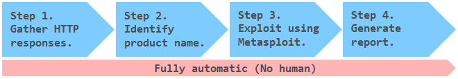
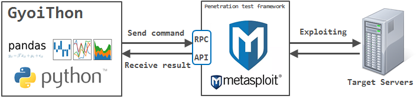

# **GyoiThon**
**Next generation penetration test tool**

---

GyoiThon at **[Black Hat ASIA 2018 Arsenal](https://www.blackhat.com/asia-18/arsenal/schedule/index.html#gyoithon-9651)**.  

## Overview
 GyoiThon is a **growing penetration test tool using Machine Learning**.  

 GyoiThon **identifies the software installed on web server** (OS, Middleware, Framework, CMS, etc...) based on the learning data. After that, it **executes valid exploits** for the identified software using Metasploit. Finally, it **generates reports** of scan results. GyoiThon executes the above processing **automatically**. 

 * Processing steps  
 

 GyoiThon executes the above "Step1" - "Step4" fully automatically.  
 **User's operation only inputs the top URL** of the target web server in GyoiThon.

 It is very easy!  
 You can identify vulnerabilities of the web servers without taking time and effort.

## Processing flow
#### Step 1. Gather HTTP responses.
 GyoiThon gathers several HTTP responses of target website while **crawling**.  
 The following are example of HTTP responses gathered by GyoiThon.  

 * Example.1  
 ```
 HTTP/1.1 200 OK
 Date: Tue, 06 Mar 2018 03:01:57 GMT
 Connection: close
 Content-Type: text/html; charset=UTF-8
 Etag: "409ed-183-53c5f732641c0"
 Content-Length: 15271

 ...snip...
 ```

 * Example.2  
 ```
 HTTP/1.1 200 OK
 Date: Tue, 06 Mar 2018 06:56:17 GMT
 Connection: close
 Content-Type: text/html; charset=UTF-8
 Set-Cookie: f00e68432b68050dee9abe33c389831e=0eba9cd0f75ca0912b4849777677f587;
 path=/;
 Content-Length: 37496

 ...snip...
 ```

 * Example.3  
 ```
 HTTP/1.1 200 OK
 Date: Tue, 06 Mar 2018 04:19:19 GMT
 Connection: close
 Content-Type: text/html; charset=UTF-8
 Content-Length: 11819

 ...snip...

  <script src="/core/misc/drupal.js?v=8.3.1"></script>
 ```

#### Step 2. Identify product name.
 GyoiThon identify product name installed on web server using **two methods**.

##### 1. based on Machine Learning.  
  By using Machine Learning (**Naive Bayes**), GyoiThon identifies software based on a **combination of slightly different features** (Etag value, Cookie value, specific HTML tag etc.) for each software. Naive Bayes is learned using the training data which example below (Training data). Unlike the signature base, Naive Bayes is stochastically identified based on various features included in HTTP response when it cannot be identified software in one feature.

   * Example.1  
   ```
   Etag: "409ed-183-53c5f732641c0"
   ```
   GyoiThon can identify the web server software **Apache**.  
   This is because GyoiThon learns features of Apache such as "**Etag header value** (409ed-183-53c5f732641c0). In our survey, Apache use **combination of numeral and lower case letters as the Etag value**. And, Etag value is **separated 4-5 digits and 3-4 digits and 12 digits, final digit is 0** in many cases.  

   * Example.2  
   ```
   Set-Cookie: f00e68432b68050dee9abe33c389831e=0eba9cd0f75ca0912b4849777677f587;
   ```
   GyoiThon can identify the CMS **Joomla!**.  
   This is because GyoiThon learns features of Joomla! such as "**Cookie name** (f00e6 ... 9831e) " and "**Cookie value** (0eba9 ... 7f587). In our survey, Joomla! uses **32 lower case letters as the Cookie name and Cookie value** in many cases.

###### Training data (One example)  
 * Joomla! (CMS)
 ```
 Set-Cookie: ([a-z|0-9]{32})=[a-z|0-9]{26,32};
 Set-Cookie: [a-z|0-9]{32}=([a-z|0-9]{26,32});
 ...snip...
 ```
 * HeartCore (Japanese famous CMS)  
 ```
 Set-Cookie:.*=([A-Z|0-9]{32});.*
 <meta name=["|'](author)["|'] content=["|']{2}.*
 ...snip...
 ```

 * Apache (Web server software)  
 ```
 Etag:.*".*-[0-9|a-z]{3,4}-[0-9|a-z]{13}")[\r\n]
 ...snip...
 ```

##### 2. based on String matching.  
 Of course, GyoiThon can identify software by **string matching** also used in traditional penetration test tools. Examples are shown below.

   * Example.3  
   ```
   <script src="/core/misc/drupal.js?v=8.3.1"></script>
   ```
   GyoiThon can identify the CMS **Drupal**.  
   It is very easy.  

#### Step 3. Exploit using Metasploit.
GyoiThon executes exploit corresponding to the identified software using Metasploit.  
And it checks whether the software is affected by the vulnerability.  

   

 * Running example  
 ```
 [*] exploit/linux/http/apache_continuum_cmd_exec, target: 0, payload: generic/custom, result: failure
 [*] exploit/linux/http/apache_continuum_cmd_exec, target: 0, payload: generic/debug_trap, result: failure
 [*] exploit/linux/http/apache_continuum_cmd_exec, target: 0, payload: generic/shell_bind_tcp, result: failure
 [*] exploit/linux/http/apache_continuum_cmd_exec, target: 0, payload: generic/shell_reverse_tcp, result: failure
 [*] exploit/linux/http/apache_continuum_cmd_exec, target: 0, payload: generic/tight_loop, result: failure

 ...snip...

 [*] exploit/multi/http/struts_code_exec_exception_delegator, target: 1, payload: linux/x86/shell/reverse_nonx_tcp, result: failure
 [*] exploit/multi/http/struts_code_exec_exception_delegator, target: 1, payload: linux/x86/shell/reverse_tcp, result: failure
 [*] exploit/multi/http/struts_code_exec_exception_delegator, target: 1, payload: linux/x86/shell/reverse_tcp_uuid, result: failure
 [*] exploit/multi/http/struts_code_exec_exception_delegator, target: 1, payload: linux/x86/shell_bind_ipv6_tcp, result: failure
 [*] exploit/multi/http/struts_code_exec_exception_delegator, target: 1, payload: linux/x86/shell_bind_tcp, result: bingo!!
 ```

#### Step 4. Generate scan report.
GyoiThon generates a report that summarizes vulnerabilities.  

 

## Usage
#### Step.1 Launch Metasploit Framework
You launch Metasploit on the remote server that installed Metasploit Framework such as Kali Linux.

```
root@kali:~# msfconsole
______________________________________________________________________________
|                                                                              |
|                   METASPLOIT CYBER MISSILE COMMAND V4                        |
|______________________________________________________________________________|
     \\                                  /                      /
      \\     .                          /                      /            x
       \\                              /                      /
        \\                            /          +           /
         \\            +             /                      /
          *                        /                      /
                                  /      .               /
   X                             /                      /            X
                                /                     ###
                               /                     # % #
                              /                       ###
                     .       /
    .                       /      .            *           .
                           /
                          *
                 +                       *

                                      ^
####      __     __     __          #######         __     __     __        ####
####    /    \\ /    \\ /    \\      ###########     /    \\ /    \\ /    \\      ####
################################################################################
################################################################################
# WAVE 4 ######## SCORE 31337 ################################## HIGH FFFFFFFF #
################################################################################
                                                          https://metasploit.com


      =[ metasploit v4.16.15-dev                         ]
+ -- --=[ 1699 exploits - 968 auxiliary - 299 post        ]
+ -- --=[ 503 payloads - 40 encoders - 10 nops            ]
+ -- --=[ Free Metasploit Pro trial: http://r-7.co/trymsp ]

msf >
```

#### Step.2 Launch RPC Server
You launch RPC Server of Metasploit following.

```
msf> load msgrpc ServerHost=192.168.220.144 ServerPort=55553 User=test Pass=test1234
[*] MSGRPC Service: 192.168.220.144:55553
[*] MSGRPC Username: test
[*] MSGRPC Password: test1234
[*] Successfully loaded plugin: msgrpc
```

 * ServerHost  
 Your Server IP address.
 * ServerPort  
 Any port number.
 * User  
 Any user name using authentication (default => msf)
 * Pass  
 Any password using authentication (default => random string)

#### Step.3 Run GyoiThon
You execute GyoiThon following command.

```
local@client:~$ python gyoithon.py -t 192.168.184.132
```

 * command options
 ```
  Usage:
      ./pyph_mod/mod_pyphOpt.py [-v | --verbose] [-t | --target <ip>] [-p | --port <port>]
             [-s | --ssl] [-S | --sni] [-l | --list <target_list>]
             [-P | --path <path_list>] [-H | --header <request_header>] [-U | --ua <ua>]
             [-m | --method <method>] [-V | --version <version>]
             [-i | --ip] [-f | --fqdn] [-D | --dryrun]
             [-b | --basic <id:pass>] [-d | --digest <id:pass>]
             [-o | --output <output_directory>] [-n | --name <name>]
             [-W | --Wait <wait_sec>] [-T | --timeout <timeout_sec>]
      ./pyph_mod/mod_pyphOpt.py -h | --help

  Options:
      -t --target <ip>               Target IP
      -p --port <port>               Target port
      -l --list <target_list>        Use target list
      -P --path <path_list>          Use path list
      -H --header <request_header>   Use custom request header(delimiter='@')
      -U --ua <ua>                   Use custom UserAgent
      -V --version <version>         HTTP protocol version
      -s --ssl                       Use ssl
      -S --sni                       Use SNI
      -b --basic <id:pass>           Use Basic Auth
      -d --digest <id:pass>          Use Digest Auth
      -m --method <method>           Use method
      -i --ip                        IP mode
      -f --fqdn                      FQDN mode
      -D --dryrun                    Dry run mode. Print curl command!!
      -n --name <name>               Suffix of log file name
      -o --output <output_directory> writting mode. Directory of output log file
      -W --wait <wait_sec>           Waitting time per request.
      -T --timeout <timeout_sec>     Timeout sec.
      -v --verbose                   Show verbose message
      -h --help                      Show this screen and exit.
 ```

## Operation check environment
 * Kali Linux 2017.3 (Guest OS on VMWare)
   * Memory: 8.0GB
   * Metasploit Framework 4.16.15-dev
 * Windows 7 Professional 64-bit (Host OS)
   * CPU: Intel(R) Core(TM) i5-5200U 2.20GHz
   * Memory: 16.0GB
   * Python 3.6.1（Anaconda3）
   * pandas 0.20.3
   * msgpack 0.4.8
   * docopt 0.6.2

## Licence
[Apache License 2.0](https://github.com/gyoisamurai/GyoiThon/blob/master/LICENSE)

## Contact us
 [gyoiler3@gmail.com](gyoiler3@gmail.com)  

 * [Masafumi Masuya](https://www.blackhat.com/asia-18/arsenal/schedule/presenters.html#masafumi-masuya-36855)  
 [https://twitter.com/gyoizamurai](https://twitter.com/gyoizamurai)
 * [Isao Takaesu](https://www.blackhat.com/asia-18/arsenal/schedule/presenters.html#isao-takaesu-33544)  
 [https://twitter.com/bbr_bbq](https://twitter.com/bbr_bbq)
